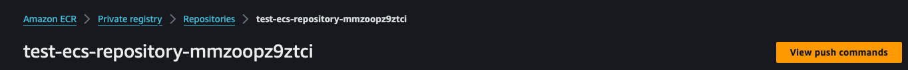
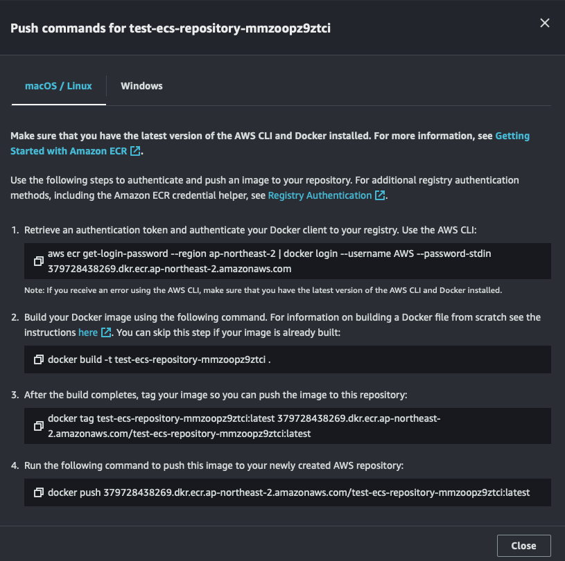

# Prerequisites

- [AWS CLI](https://formulae.brew.sh/formula/awscli)
- [AWS CLI configuration](https://docs.aws.amazon.com/cli/latest/reference/configure/)
  - It is recommended to use the `profile` flag.
  - The IAM user should have permissions to create, **update, and delete** all resources defined in the template
  - Grant the IAM user [AWSCloudFormationFullAccess](https://docs.aws.amazon.com/aws-managed-policy/latest/reference/AWSCloudFormationFullAccess.html)
- (Optional) [CloudFormation Lint](https://formulae.brew.sh/formula/cfn-lint) 

# How to deploy

## Manual deployment

1. Run Lint
   ```Shell
    $ cfn-lint template.yaml
   ```
2. Deploy
    ```Shell
   $ aws cloudformation deploy --stack-name [STACK_NAME] --template-file [TEMPLATE_FILE_NAME] --capabilities CAPABILITY_IAM
   ```
    - `stack-name` flag is **required**.
    - `template-file` flag is **required**.
    - `capabilities` flag with CAPABILITY_IAM argument is required; it allows CloudFormation to create and update AWS IAM resource on behalf of the developer.
    - (optional) Use `parameters [file://path/to/template.yaml]` flag to override default parameters. 

3. During deployment, upload image to ECR repository.
    - Go to created repository
    - 
    - 
    - Upload image using the guideline.

[//]: # (todo ECR 사진에 unitybill account id 첨부되었으니 마스킹하기)

# QnA


# Todos

- SSL
- CD
- VPC Endpoint (Private Link) to connect ECR and CW (and more?)
- Dockerfile heath check https://kimjingo.tistory.com/74
- 